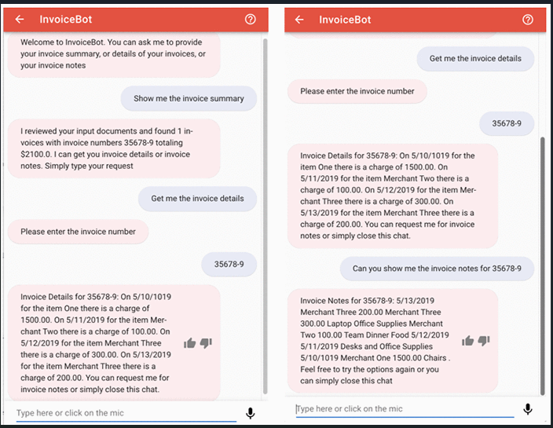

# Conversational Insights from Invoices Solution

Industrial organizations have a large number of physical documents such as invoices that need to processed. It is difficult to extract information from a scanned invoices that contains data in form of tables, forms and check boxes. Usually these problems have been addressed either by manual effort or custom code or by using Optical Character Recognition (OCR) technology. However, that too requires pre-defined templates for form extraction and workflows.

Extracting insights from these invoices for their end users require building a complex NLP model. Training the model would require a large amount of training data , computing resources and can be expensive and time-consuming.

Also , it is quite expensive and cumbersome to use human help desk for organizations.

This project aims to solve these problems by using AWS AI services(Textract, Comprehend and Lex) to create an automated serverless solution for text processing ,insight discovery and interaction in natural language with end users. 

## How does this work on backend?
1 ) The backend administrator uses the AWS Console or AWS CLI to upload the PDF documents or images to S3 bucket.

2 ) The Amazon S3 upload triggers a AWS Lambda function that invokes Textract **StartDocumentTextDetection** API, which starts a job to detect text from the uploaded       invoice.

3 ) Textract notifies Simple Notification Service (SNS) when text processing is complete.

4 ) Once the lambda is notified of job completion from SNS, it calls Textract **GetDocumentTextDetection** API to receive the result from the operation and loads the       results into S3 bucket.

5 ) Amazon Comprehend uses ML to find insights and relationships in text.

6 ) In response to the Bot’s welcome message, the user types “Show me the invoice summary”, this invokes the **GetInvoiceSummary** intent and the Lambda function           invokes Comprehend **DetectEntities** API to detect entities.

7 ) When the user types “Get me the invoice details”, this invokes the **GetInvoiceDetails** intent, Lex requests the user for Invoice Number, and the Lambda function     invokes the Comprehend **DetectEntities** API to return the Invoice Details.

8 ) When the user types “Can you show me the invoice notes for <invoice number>”, this invokes the **GetInvoiceNotes** intent, and the Lambda function invokes the         Comprehend **DetectKeyPhrases** API to return key insights.
  
  ## Working Prototype
  
  
